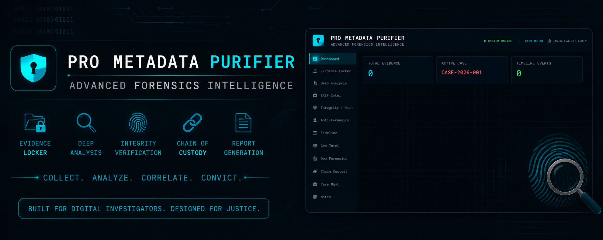

# Pro-Metadata-Purifier-
Pro Meta Data Purifier is an advanced Cyber Forensics and Metadata Intelligence platform developed to perform deep forensic analysis on digital files and uncover hidden information embedded within them. The application is designed for cybersecurity professionals, digital investigators, OSINT researchers, ethical hackers, and forensic .

---
## 🖼️ Project Preview

  

